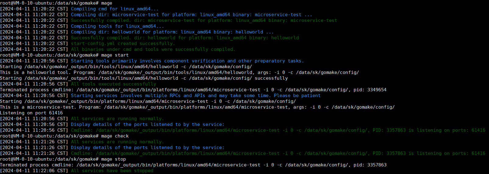
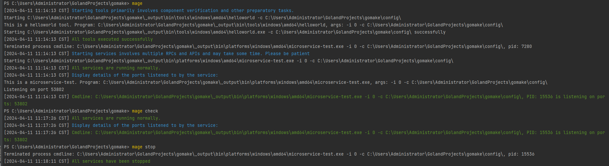

# gomake User Guide

**gomake** is a tool built on Mage that offers cross-platform and multi-architecture compilation support. It also simplifies the process of starting, stopping, and monitoring services.

## User Guide

### Preparation

1. Copy the following files from the current directory to the project's root directory, noting that there are 5 files to copy besides the `README` file:
   - `bootstrap.bat`
   - `bootstrap.sh`
   - `magefile.go`
   - `magefile_unix.go`
   - `magefile_windows.go`
2. The project's root directory should contain three directories: `cmd`, `tools`, and `config`.
   - The `cmd` directory is specifically for storing the startup code of applications that run as background services.
   - The `tools` directory is for storing the startup code of applications that run as tools (not as background services).
   - The `config` directory is for storing configuration files.
3. The `cmd` and `tools` directories can contain multiple subdirectories. For files containing a `main` function in the `main package`, they should be named `main.go`. For example:
   - `cmd/microservice-test/main.go`
   - `tools/helloworld/main.go`
   - All code should belong to the same project, and subdirectories should not use independent `go.mod` and `go.sum` files.

### Project Initialization

- For Linux/Mac systems, execute the `bootstrap.sh` script first.
- For Windows systems, execute the `bootstrap.bat` script first.

### Compiling the Project

- Run `mage` or `mage build` to compile the project.
- After compilation, binary files will be generated in the `_output/bin/platforms/<operating system>/<architecture>` directory, with the binary files named after the directory of the corresponding `main.go`. For example:
  - `_output/bin/platforms/linux/amd64/microservice-test`
  - `_output/bin/tools/linux/amd64/helloworld`
  - **Note:** Binary files on the Windows platform will automatically have a `.exe` extension added.

### Starting Tools and Services

1. After completing the `mage` compilation, the system will automatically generate a `start-config.yml` file specifying the configuration for services and tools, which you can edit. For example:

   ```yaml
   serviceBinaries:
     microservice-test: 1
   toolBinaries:
     - helloworld
   maxFileDescriptors: 10000
   ```

**Note:** Ensure that the service names and tool names match the names of the subdirectories under the `cmd` and `tools` directories. The number after the service name represents the number of instances of the service to start.

2. Run `mage start` to start the services and tools.

   - Tools will execute synchronously, and if a tool fails (exits with a non-zero exit code), the entire start-up process will be interrupted.
   - Services will start asynchronously.

For all tools, the following command format will be used to start: `[absolute path to program] -i 0 -c [absolute directory of configuration file]`.

If the service instance count is set to `n`, then `n` instances of the service will be started, with each instance using the command format: `[program path] -i [instance index] -c [configuration file directory]`, where the instance index ranges from `0` to `n-1`.

**Note:** This project only specifies the path of the configuration file and does not handle reading the content of the configuration file. This is done to support scenarios using multiple configuration files. Both the program and configuration file paths are automatically converted to absolute paths.

### Checking and Stopping Services

- Run `mage check` to check the status of services and the ports they are listening on.
- Run `mage stop` to stop the services. This command will send a stop signal to the services.

### Screenshots

- **Linux** 
  
- **Windows**
  
  
  
  
